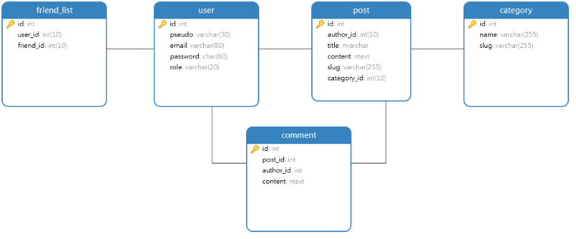

# Forum / blog website and mobile application tutos and questions : 

## Technos :
* API with symfony and api platform
* Front-end with Angular
    * mobile first approach
* Database with maria db
* Mobile application with ionic When the website will be fully completed

## Features :
* post edit and delete an article
* post edit and delete a comment
* add Friend
* real time chattbox with web socket for the users who are friend
* list of articles publiched into the public profile of a user
* Admin dashboard
    * List of posts and comments
    * Create an admin post
    * modify the navbar and the footer of the website (not the style but only the text)
    * delete an article 
    * delete a user
    * put an advertisement to a user
* Progressive web app with service worker (offline pages templates, saving posts or tutos to see it later offline and application could be installed from the navigator)
* switch the website to english and french

## database model :
